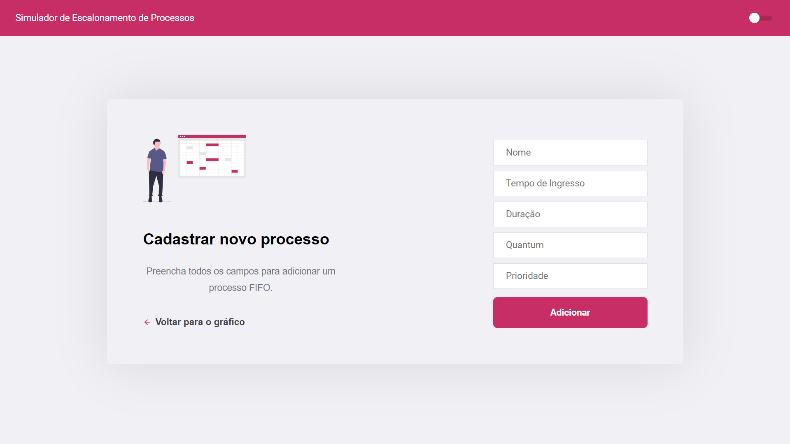
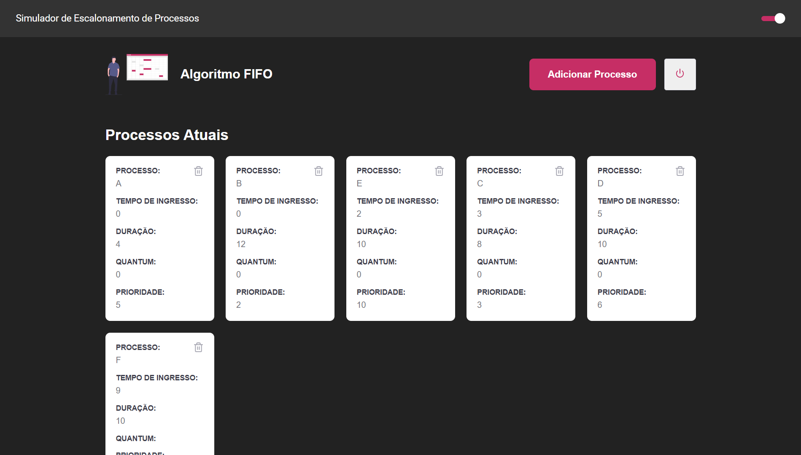

#

<h4 align="center">
  <b>👨‍💻 Simulador de Escalonamento de Processos 🖥️</b>
</h4>

<p align="center">
  <a href="#-projeto">Projeto</a> |
  <a href="#-tecnologias">Tecnologias</a> |
  <a href="#-screenshots">Screenshots</a> |
  <a href="#-instalação">Instalação</a>   |
</p>

<br>

### 🚀 Projeto

O projeto têm como objetivo simular processos nos Algoritmos FIFO, SJF, Round Robin e Prioridade Fifo
Projeto na versão beta.

Observação: Para os amantes de temas escuros, disponibilizamos uma opção Dark e a opção Light.

### 👨‍💻 Tecnologias  

SEP foi desenvolvido a partir das tecnologias:

* [NodeJS](https://nodejs.org/pt-br/)
* [ReactJS](https://reactjs.org)
* [Express](https://expressjs.com/pt-br/)
* [Nodemon](https://www.npmjs.com/package/nodemon)
* [Axios](https://www.npmjs.com/package/axios)
* [Cors](https://www.npmjs.com/package/cors)
* [Eslint](https://www.npmjs.com/package/eslint)

### 📸 Screenshots

#### 💻 Frontend

##### Tela de Menu


##### Tela de Cadastro de Processos



##### Tela de Processos



### 💾 Instalação

Clone este repositório:

```bash
git clone https://github.com/Eliton-Dioni/simulador-escalonamento-processos.git
```

Entre na pasta do projeto:

```bash
cd simulador-escalonamento-processos/
```

### Backend

Para instalar todas as depêndencias do backend, execute o comando:

```bash
cd simulador-escalonamento-processos/backend
npm install
```

Para rodar o servidor NodeJS, dentro do diretório `backend`, execute o comando:

```bash
npm start
```

#### Frontend

Para instalar todas as depêndencias, execute o comando:

```bash
cd simulador-escalonamento-processos/frontend
npm install
```

Para rodar a aplicação ReactJS, dentro do diretório `frontend`, execute o comando:

```bash
npm start
```

A aplicação web iniciará automaticamente no seu navegador padrão.

### ♻️ Contribuição

Sempre podemos nos aperfeiçoar, me ajude a criar um repositório cada vez melhor!

* Faça um fork desse repositório via Github;
* Crie uma branch com a sua feature: `git checkout -b my-feature-example`
* Faça commit das suas mudanças: `git commit -m 'feat: My new feature example'`
* Dê Push na sua branch: `git push origin my-feature-example`

### 📝 Licença

Esse projeto está sob a licença MIT. Veja o arquivo [LICENSE](./LICENSE.md) para mais detalhes.

</br>

Criado com ❤️ e ☕ por Eliton Dioni [LinkedIn](https://www.linkedin.com/in/eliton-dioni/) e Otávio Pohren [LinkedIn](https://www.linkedin.com/in/ot%C3%A1vio-p-810820137/)
